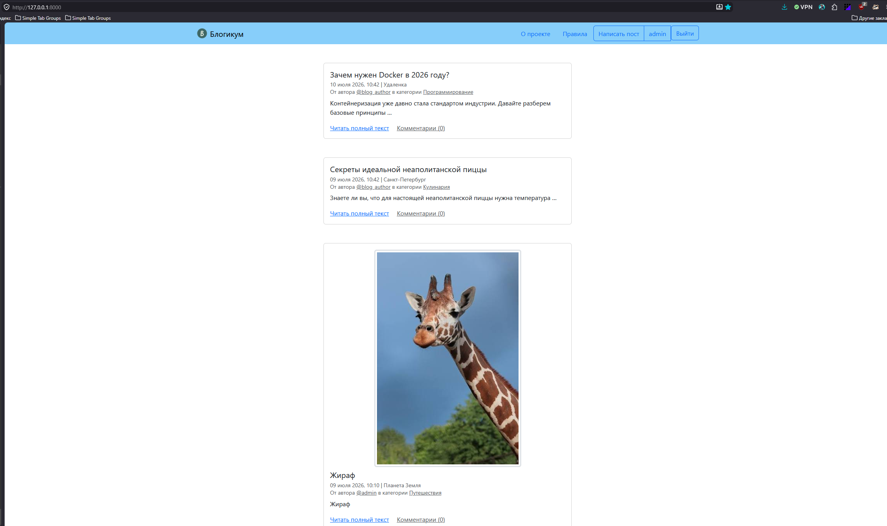
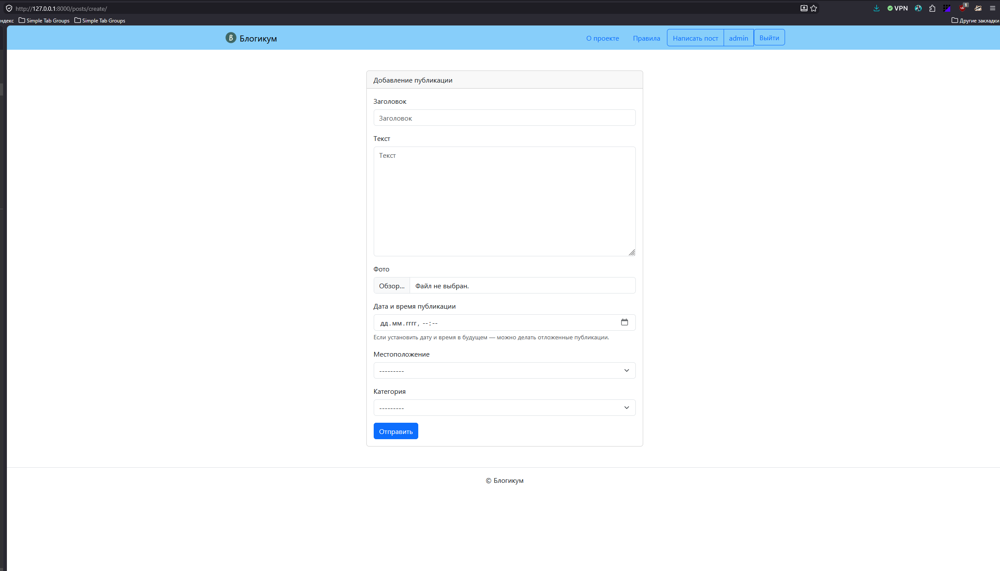
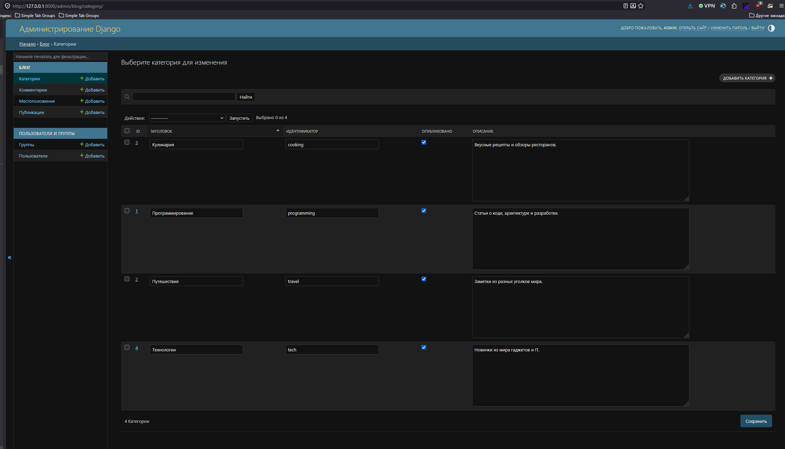

# Blogicum

**Blogicum** — это платформа для ведения блога с рендерингом страниц на стороне сервера.
Данный репозиторий демонстрирует владение архитектурой **Django MVT (Model-View-Template)**. 

**Главная страница Blogicum:**


**Создание поста в Blogicum:**


**Admin-зона blogicum**


## 🛠 Ключевые фичи и архитектура бэкенда

В процессе разработки проекта были спроектированы и внедрены следующие архитектурные решения:

*   **Полноценный CRUD для контента**: Реализована бизнес-логика управления публикациями. Посты могут быть привязаны к тематическим категориям и комментироваться пользователями. Внедрена **логика отложенных публикаций**: посты со статусом "Черновик" или с датой публикации в будущем скрыты от обычных пользователей и доступны только их авторам.
*   **Авторизация и система профилей**: Построена надежная система регистрации, аутентификации и управления сессиями средствами Django. Разработаны кастомные страницы профилей, где авторы могут просматривать списки своих публикаций и редактировать личные данные.
*   **Работа с медиафайлами**: Настроена серверная обработка пользовательского контента. Реализована валидация, загрузка и безопасное хранение изображений для постов через ImageField.
*   **Безопасность и Права доступа**: Реализовано жесткое разграничение прав на базе Permissions и Mixins. Неавторизованные пользователи (гости) имеют доступ исключительно к чтению контента. Авторизованные пользователи получают возможность оставлять комментарии. Право на редактирование или удаление публикаций и комментариев строго закреплено за их создателями.

## Технологический стек

*   **Язык программирования**: Python 3
*   **Фреймворк**: Django 5
*   **База данных**: SQLite
*   **Формы и Валидация**: Django Forms
*   **Фронтенд**: HTML5, CSS3, Bootstrap

## Инструкция по локальному запуску

**1. Клонирование репозитория**
```bash
git clone https://github.com/VoltusV5/django-sprint4.git
cd django-sprint4
```

**2. Создание и активация виртуального окружения**

*   **Для Windows**:
    ```powershell
    python -m venv venv
    .\venv\Scripts\activate
    ```
*   **Для macOS / Linux**:
    ```bash
    python3 -m venv venv
    source venv/bin/activate
    ```

**3. Установка зависимостей**
```bash
pip install -r requirements.txt
```

**4. Применение миграций базы данных**
```bash
python manage.py migrate
```

**5. Создание суперпользователя**
Чтобы получить доступ к панели администратора Django, создайте аккаунт суперпользователя:
```bash
python manage.py createsuperuser
```

**6. Запуск локального сервера**
```bash
python manage.py runserver
```

После успешного запуска проект будет доступен в вашем браузере по адресу: `http://127.0.0.1:8000/`. Панель администратора находится по адресу: `http://127.0.0.1:8000/admin/`.